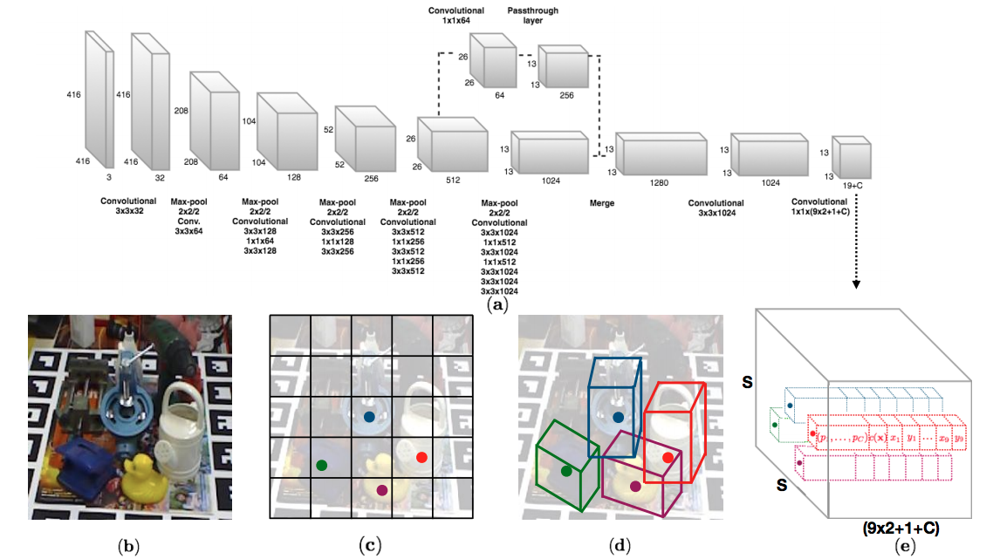
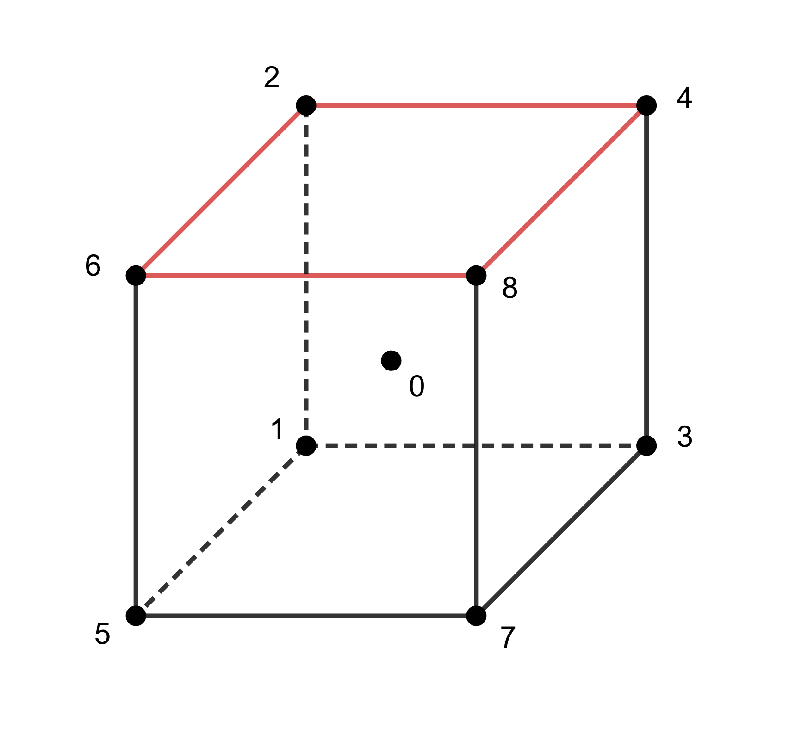
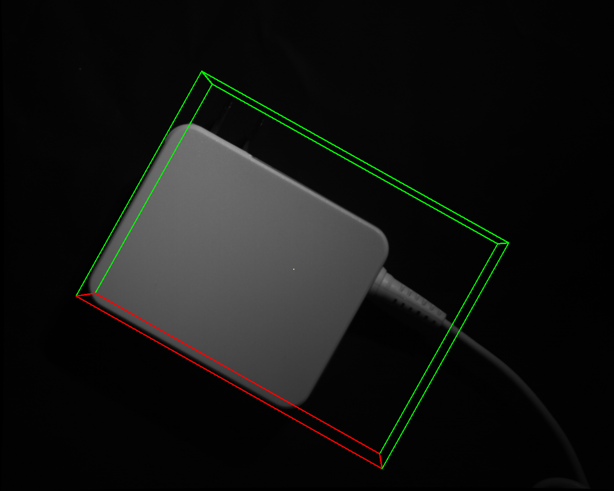
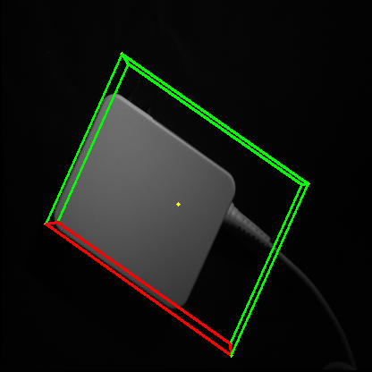
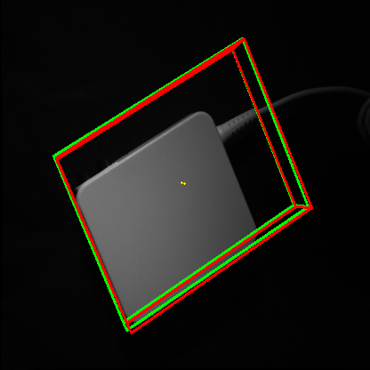
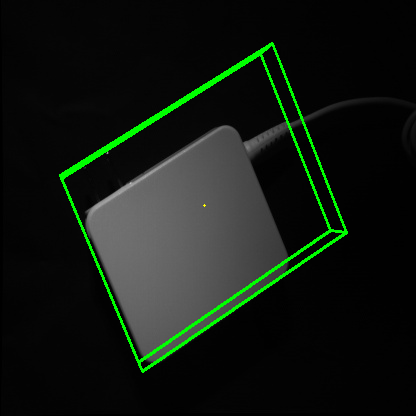
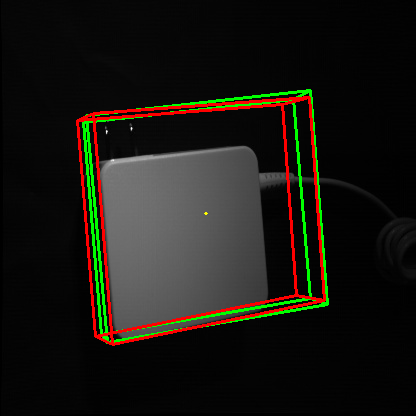
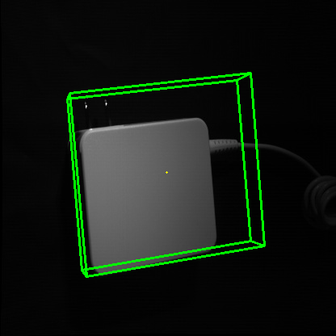

# Yolo-6D Training Log

## Yolo-6D

Yolo-6D provides 9 points prediction for the 3D-Bounding-box prejection (and its centre point) on given 2D image. Thefore, using PnP (*Perspective n point*), we can restore its 3D pose.

<div align=center>
  
</div>

Training inputs:

- Feature: $416 \times 416$ images

- Label: 21 labels which consists of 

  - class label

  - x_0 and y_0  (x,y coordinates of the centroid)
  - x_i and y_i  (8 pairs of x,y coordinates of the corners)
  - x range
  - y range

---

## Algorithm

Our project adapted previous work from Microsoft on [github](https://github.com/btekin/singleshot6Dpose), based on paper [*Real-Time Seamless Single Shot 6D Object Pose Prediction*](http://openaccess.thecvf.com/content_cvpr_2018/papers/Tekin_Real-Time_Seamless_Single_CVPR_2018_paper.pdf).

#### Citation

If you use this code, please cite the following

> @inproceedings{tekin18,  
> &nbsp;&nbsp;&nbsp;&nbsp;&nbsp;&nbsp;TITLE = {{Real-Time Seamless Single Shot 6D Object Pose Prediction}},  
> &nbsp;&nbsp;&nbsp;&nbsp;&nbsp;&nbsp;AUTHOR = {Tekin, Bugra and Sinha, Sudipta N. and Fua, Pascal},  
> &nbsp;&nbsp;&nbsp;&nbsp;&nbsp;&nbsp;BOOKTITLE =  {CVPR},  
> &nbsp;&nbsp;&nbsp;&nbsp;&nbsp;&nbsp;YEAR = {2018}  
> }

### Abstract

**Interface**

- Pre-training:

  ```bash
  python train.py datafile cfgfile weightfile cp modelfile initmodelfile
  ```

  e.g.

  ```bash
  python train_withvalidation.py cfg/RR.data cfg/yolo-pose-pre.cfg cfg/darknet19_448.conv.23 cp backup/RR/model.weights backup/RR/init.weights
  ```

- Training:

  ```bash
  python train.py datafile cfgfile initweightfile
  ```

  e.g.

  ```bash
  python train_withvalidation.py cfg/RR.data cfg/yolo-pose.cfg backup/RR/model.weights
  ```

- Testing:

  ```
  python valid.py datafile cfgfile weightfile
  ```

  e.g.

  ```bash
  python valid_n.py cfg/RR.data cfg/yolo-pose.cfg backup/RR/model.weights
  ```

**Training Stage**

- Max epochs:	700

- `vx_threshold = diam * 0.1` [???]

- **Substitute backgound** 

  Loading background file from `bg_file_names = 'VOCdevkit/VOC2012/JPEGImages'`

  To cope with limited training dataset, the algorithm generates more training resouce by substituting the backgrounds of the existing image given the background region selected by the mask.

- **Evaluate accuracies both in 2D and 3D.**

  Note that the errors in our projects are primarily from two sources:

  1. The deviation in 2D projection points (output of this model).
  2. The deviation generated from using PnP algorithm (post-processing of output to restore the results to 3D coordinates).

  Therefore, the accuracy is evaluated from (at least) two aspects:

  1. Norm of difference between ground truth and prediction in 2D;

  2. Norm of difference between ground truth coordinates and prediction coordinates in 3D.

     It is noteworthy that the inputs are points projection in the image plane. Hence, object information is gained from the CAD model from `.ply` file. It implements `PnP` function to compare the difference of 3D coordinates.

- **Loss function**

  TBF

---

## First stage - replicate previous project

Following the dataset and instruction provided by RR, we confirm that 700 images in the format of png are to be used, labels are given in the form of pose matrix and camera calibration file.

Pose Matrix
<div align=center>
   
</div>

Rotation Matrix

<div align=center>
   
</div>>

Translation Vectore
<div align=center>
   
</div>


**Links Related:**

[*Expressing Pose: rotation and translation matrices and vectors* ](http://homepages.inf.ed.ac.uk/rbf/CVonline/LOCAL_COPIES/MARBLE/high/pose/express.htm)

[*Homogeneous coordinates*](https://en.wikipedia.org/wiki/Homogeneous_coordinates)

---

### Dataset

The training data were collected from RR using the <u>depth camera</u> (left/right cameras). 

Each set of photos is with <u>the pose matrix</u> (rotation matrix and translation vector). 

**N.B**	

- The pose matrices are with respect to the right camera, hence, only right camera images are used for training.
- The images are after calibration; therefore,  the argument distorsion factor in the function should be set to 0.

### Data pre-processing

#### primary function used in this process

[*Document Link*](https://docs.opencv.org/2.4/modules/calib3d/doc/camera_calibration_and_3d_reconstruction.html#bool%20solvePnP(InputArray%20objectPoints,%20InputArray%20imagePoints,%20InputArray%20cameraMatrix,%20InputArray%20distCoeffs,%20OutputArray%20rvec,%20OutputArray%20tvec,%20bool%20useExtrinsicGuess,%20int%20flags))

- ``cv2.projectPoints``

  **Python:** ` cv2.projectPoints(objectPoints, rvec, tvec, cameraMatrix, distCoeffs[, imagePoints[, jacobian[, aspectRatio]]]) ` 

  `→ imagePoints, jacobian`

  given that the image data has already been calibrated, in practice we use:

  `cv2.projectPoints(objectPoints, rvec, tvec, cameraMatrix, distCoeffs=0) `

  ---

- ``cv2.solvePnP``

  **Python:** ` cv2.solvePnP(objectPoints, imagePoints, cameraMatrix, distCoeffs[, rvec[, tvec[, useExtrinsicGuess[, flags]]]]) ` 

  `→ retval, rvec, tvec`

  given that the image data has already been calibrated, in practice we use:

  **in practice:** `cv2.solvePnP(objectPoints, imagePoints, cameraMatrix, distCoeffs=0) `

In both functions, the parameters we use:

- `objectPoints`	points to be projected

  numpy array (9, 3)	[[x_0, y_0, z_0], [x_1, y_2, z_3], ... , [x_8, y_8, z_8]]

- `rvec`	roration vector

  numpy array (3, 3)	[[r_{11},r_{12},r_{13}],[r_{21},r_{22},r_{23}],[r_{31},r_{32},r_{33}]]

- `tvec`	translation vector

  numpy array (3)	[t_1, t_2, t_3]

- `cameraMatrix`	camera matrix

  numpy array (3, 3)	[[c_{11},c_{12},c_{13}],[c_{21},c_{22},c_{23}],[c_{31},c_{32},c_{33}]]

- `imagePoints`	projections on the image plane

  numpy array (9, 1, 2)	[[[x_0,y_o]],[[x_1,y_1]], ... ,[[x_8,y_8]]]

---

### File path


- `objectPoints` were corner coordinates obtained from `AD2080UL.ply` (CAD model)

  This gives us the `min` and `max` of *x,y,z* coordinates:

   ```
  min_coordinates, x:-0.03880799934267998, y:-0.01425000000745058, z:-0.02686610072851181
  max_coordinates, x:0.0783919021487236, y:0.01425000000745058, z:0.05917999893426895
   ```

  <div align=center>
    
  </div>

  The relative location of those points are demonstrated above.

- `rvec` and `tvec` were obtained from `Allposts.txt`, sample text as below:

  ```
  8.718825837190480321e-01 -2.114283667772026698e-02 -4.892583577871398859e-01 -2.095019081383128778e+01
  4.892659098802886186e-01 -5.167555801494388111e-03 8.721193529534695399e-01 -1.741347829752978527e+01
  -2.096734690818781097e-02 -9.997631103537631958e-01 5.838967320857203248e-03 3.909154163959203743e+02
  0.000000000000000000e+00 0.000000000000000000e+00 0.000000000000000000e+00 1.000000000000000000e+00
  ```

  Four rows per image.

- `cameraMatrix` was obtained from `PR.txt`, noticed that the pose is object to the right camera. Therefore, only right images are used and calibration file is from the right camera. `PR.txt`:

  ```
  2.356280953576224874e+03 0.000000000000000000e+00 6.823281173706054688e+02 0.000000000000000000e+00
  0.000000000000000000e+00 2.356280953576224874e+03 5.228933753967285156e+02 0.000000000000000000e+00
  0.000000000000000000e+00 0.000000000000000000e+00 1.000000000000000000e+00 0.000000000000000000e+00
  ```

  We only take top right 3x3 matrix.

---

### Sample photo generated

1280 * 1024 with lines marked

<div align=center>
  
</div>

416 * 416 with lines marked

<div align=center>
  
</div>

---

### Image and labels generated

```
- RR
	- RR
    - JPEGImages
      - 000000.jpg ~ 000699.jpg
    - labels
      - 000000.txt ~ 000699.txt
    - mask
      - 0000.png - 0699.png
    - objects.txt
    - test.txt
    - train.txt
    - training_range.txt
    - AD2080UL.ply
```

In the `test.txt` file, the testing file paths are listed as below:

```
RR/RR/JPEGImages/000552.jpg
RR/RR/JPEGImages/000296.jpg
...
```

In the `train.txt` file, the training file paths are listed as below:

```
RR/RR/JPEGImages/000000.jpg
RR/RR/JPEGImages/000001.jpg
...
```

In the `training_range.txt` file, the training file numbers are listed as below:

```
0
1
```

#### Label files

Our label files consist of 21 values. We predict 9 points corresponding to the centroid and corners of the 3D object model. Additionally we predict the class in each cell. That makes 9x2+1 = 19 points. In multi-object training, during training, we assign whichever anchor box has the most similar size to the current object as the responsible one to predict the 2D coordinates for that object. To encode the size of the objects, we have additional 2 numbers for the range in x dimension and y dimension. Therefore, we have 9x2+1+2 = 21 numbers.

Respectively, 21 numbers correspond to the following: 1st number: class label, 2nd number: x0 (x-coordinate of the centroid), 3rd number: y0 (y-coordinate of the centroid), 4th number: x1 (x-coordinate of the first corner), 5th number: y1 (y-coordinate of the first corner), ..., 18th number: x8 (x-coordinate of the eighth corner), 19th number: y8 (y-coordinate of the eighth corner), 20th number: x range, 21st number: y range.

The coordinates are normalized by the image width and height: x / image_width and y / image_height. This is useful to have similar output ranges for the coordinate regression and object classification tasks.

---

### Problems found

1. **RuntimeError: The shape of the mask [169] at index 0 does not match the shape of the indexed tensor [1, 13, 13] at index 0**

   ```bash
   2019-08-24 00:18:06 epoch 0, processed 0 samples, lr 0.000100
   Traceback (most recent call last):
     File "train.py", line 400, in <module>
       niter = train(epoch)
     File "train.py", line 94, in train
       loss = region_loss(output, target)
     File "/home/eric/anaconda3/lib/python3.7/site-packages/torch/nn/modules/module.py", line 477, in __call__
       result = self.forward(*input, **kwargs)
     File "/home/eric/singleshot6Dpose/region_loss.py", line 229, in forward
       build_targets(pred_corners, target.data, self.anchors, nA, nC, nH, nW, self.noobject_scale, self.object_scale, self.thresh, self.seen)
     File "/home/eric/singleshot6Dpose/region_loss.py", line 67, in build_targets
       conf_mask[b][cur_confs>sil_thresh] = 0
   RuntimeError: The shape of the mask [169] at index 0 does not match the shape of the indexed tensor [1, 13, 13] at index 0
   ```

   **Solution:** 

   The coordinates representation is inconsistent with the programme.

   The first pair of coordinates should be of the centroid point.

2. **RuntimeError: CUDA error: out of memory**

   ```bash
   2019-08-24 01:22:15 epoch 22, processed 12320 samples, lr 0.001000
   train time: 17
   ...
   12912: nGT 32, recall 24, proposals 5408, loss: x 18.304237, y 26.090311, conf 0.000000, total 44.394547
   
   Traceback (most recent call last):
     File "train.py", line 401, in <module>
       niter = train(epoch)
     File "train.py", line 89, in train
       output = model(data)
     File "/home/eric/anaconda3/lib/python3.7/site-packages/torch/nn/modules/module.py", line 477, in __call__
       result = self.forward(*input, **kwargs)
     File "/home/eric/singleshot6Dpose/darknet.py", line 91, in forward
       x = self.models[ind](x)
     File "/home/eric/anaconda3/lib/python3.7/site-packages/torch/nn/modules/module.py", line 477, in __call__
       result = self.forward(*input, **kwargs)
     File "/home/eric/anaconda3/lib/python3.7/site-packages/torch/nn/modules/container.py", line 91, in forward
       input = module(input)
     File "/home/eric/anaconda3/lib/python3.7/site-packages/torch/nn/modules/module.py", line 477, in __call__
       result = self.forward(*input, **kwargs)
     File "/home/eric/anaconda3/lib/python3.7/site-packages/torch/nn/modules/conv.py", line 301, in forward
       self.padding, self.dilation, self.groups)
   RuntimeError: CUDA error: out of memory
   ```

   **Solution:** we adjusted the batch size in the cfg file(s):

   ```bash
   # batch=32
   batch=8
   ```

   

3. **The Acc using 5 px 2D Projection = 0.00%, only the first testing model was stored.**

   ```bash
   2019-08-24 02:55:28    Testing...
   2019-08-24 02:55:28    Number of test samples: 140
   -----------------------------------
     tensor to cuda : 0.000916
            predict : 0.002532
   get_region_boxes : 0.015031
               eval : 0.006863
              total : 0.025343
   -----------------------------------
   2019-08-24 02:55:32    Mean corner error is 272.343262
   2019-08-24 02:55:32    Acc using 5 px 2D Projection = 0.00%
   2019-08-24 02:55:32    Acc using 0.0103 vx 3D Transformation = 13.57%
   2019-08-24 02:55:32    Acc using 5 cm 5 degree metric = 7.14%
   2019-08-24 02:55:32    Translation error: 0.027698, angle error: 117.140201
   2019-08-24 02:55:32 save training stats to backup/RR/costs.npz
   2019-08-24 02:55:32 best model so far!
   2019-08-24 02:55:32 save weights to backup/RR/model.weights
   2019-08-24 02:55:32 epoch 11, processed 6160 samples, lr 0.001000
   ```

   best error and accuracy found in 700 epoches training:

   ```bash
   218960: nGT 8, recall 4, proposals 105, loss: x 53.032261, y 21.392193, conf 1.809403, total 76.233856
   2019-08-24 04:36:43    Testing...
   2019-08-24 04:36:43    Number of test samples: 140
   -----------------------------------
     tensor to cuda : 0.000925
            predict : 0.002766
   get_region_boxes : 0.016032
               eval : 0.010010
              total : 0.029733
   -----------------------------------
   2019-08-24 04:36:47    Mean corner error is 148.449524
   2019-08-24 04:36:47    Acc using 5 px 2D Projection = 0.00%
   2019-08-24 04:36:47    Acc using 0.0103 vx 3D Transformation = 44.29%
   2019-08-24 04:36:47    Acc using 5 cm 5 degree metric = 32.14%
   2019-08-24 04:36:47    Translation error: 0.015558, angle error: 71.405767
   2019-08-24 04:36:47 save training stats to backup/RR/costs.npz
   2019-08-24 04:36:47 epoch 391, processed 218960 samples, lr 0.000010
   ```

   ```bash
   319760: nGT 8, recall 5, proposals 97, loss: x 13.335744, y 10.880935, conf 1.583052, total 25.799730
   2019-08-24 05:25:49    Testing...
   2019-08-24 05:25:49    Number of test samples: 140
   -----------------------------------
     tensor to cuda : 0.000919
            predict : 0.002697
   get_region_boxes : 0.015148
               eval : 0.009107
              total : 0.027871
   -----------------------------------
   2019-08-24 05:25:53    Mean corner error is 137.203857
   2019-08-24 05:25:53    Acc using 5 px 2D Projection = 0.00%
   2019-08-24 05:25:53    Acc using 0.0103 vx 3D Transformation = 47.14%
   2019-08-24 05:25:53    Acc using 5 cm 5 degree metric = 37.86%
   2019-08-24 05:25:53    Translation error: 0.014357, angle error: 65.616170
   2019-08-24 05:25:53 save training stats to backup/RR/costs.npz
   2019-08-24 05:25:53 epoch 571, processed 319760 samples, lr 0.000010
   ```

   **Solution:**

   This may be resulted from a relatively high threshold (5), we adjusted it to 100 in pretraining.

   In `training.py`:

   ```python
    # Compute 2D projection, 6D pose and 5cm5degree scores
       px_threshold = 100 # originally 5
   ```

4. **The acc does not exprence a significant increase in the <u>pre-training stage</u>:**

   ```bash
   -----------------------------------
     tensor to cuda : 0.000413
            predict : 0.002565
   get_region_boxes : 0.014863
               eval : 0.009417
              total : 0.027257
   -----------------------------------
   2019-08-25 01:44:22    Mean corner error is 178.555389
   2019-08-25 01:44:22    Acc using 100 px 2D Projection = 3.57%
   2019-08-25 01:44:22    Acc using 0.0103 vx 3D Transformation = 0.00%
   2019-08-25 01:44:22    Acc using 5 cm 5 degree metric = 0.00%
   2019-08-25 01:44:22    Translation error: 1.095448, angle error: 93.475406
   2019-08-25 01:44:22 save training stats to backup/RR/costs.npz
   2019-08-25 01:44:22 best model so far!
   2019-08-25 01:44:22 save weights to backup/RR/model.weights
   2019-08-25 01:44:22 epoch 11, processed 6160 samples, lr 0.001000
   ```

   **Follow up:**

   In the <u>training</u> network, the acc sees a significant improvement and the mean corner error also significantly decreases.

   ```bash
   -----------------------------------
     tensor to cuda : 0.000414
            predict : 0.002687
   get_region_boxes : 0.005845
               eval : 0.006310
              total : 0.015256
   -----------------------------------
   2019-08-25 03:35:04    Mean corner error is 45.728725
   2019-08-25 03:35:04    Acc using 100 px 2D Projection = 86.43%
   2019-08-25 03:35:04    Acc using 0.0103 vx 3D Transformation = 12.14%
   2019-08-25 03:35:04    Acc using 5 cm 5 degree metric = 38.57%
   2019-08-25 03:35:04    Translation error: 0.032392, angle error: 33.324786
   2019-08-25 03:35:04 save training stats to backup/RR/costs.npz
   ```

5. **The prediction value exceeds the img size**

   ```bash
   proj_2d_gt:  [[ 77.865395  78.4644   111.31902  ... 104.55574   99.033134 103.95914 ]
    [193.62724  193.5229   195.85432  ... 280.01727  235.75565  271.97104 ]]
   proj_2d_pred:  [[135.88646 135.85165 179.30357 ... 241.15886 200.00972 234.26067]
    [447.81372 447.02255 457.04312 ... 438.23682 448.61377 440.24307]]
   ```

   Follow up


---

### Log

1. **24 Aug**, with threshold == 100:

   ```bash
   -----------------------------------
     tensor to cuda : 0.000419
            predict : 0.002980
   get_region_boxes : 0.006062
               eval : 0.007304
              total : 0.016765
   -----------------------------------
   2019-08-25 03:45:31    Mean corner error is 19.807261
   2019-08-25 03:45:31    Acc using 100 px 2D Projection = 95.00%
   2019-08-25 03:45:31    Acc using 0.0103 vx 3D Transformation = 20.00%
   2019-08-25 03:45:31    Acc using 5 cm 5 degree metric = 57.14%
   2019-08-25 03:45:31    Translation error: 0.028696, angle error: 16.462392
   2019-08-25 03:45:31 save training stats to backup/RR/costs.npz
   2019-08-25 03:45:31 best model so far!
   2019-08-25 03:45:31 save weights to backup/RR/model.weights
   ```

   Change the threshold to 10

   ```bash
   -----------------------------------
     tensor to cuda : 0.000441
            predict : 0.002935
   get_region_boxes : 0.006074
               eval : 0.006964
              total : 0.016414
   -----------------------------------
   2019-08-25 03:53:03    Mean corner error is 9.195710
   2019-08-25 03:53:03    Acc using 10 px 2D Projection = 87.86%
   2019-08-25 03:53:03    Acc using 0.0103 vx 3D Transformation = 14.29%
   2019-08-25 03:53:03    Acc using 5 cm 5 degree metric = 56.43%
   2019-08-25 03:53:03    Translation error: 0.030027, angle error: 9.396243
   2019-08-25 03:53:03 save training stats to backup/RR/costs.npz
   2019-08-25 03:53:03 best model so far!
   2019-08-25 03:53:03 save weights to backup/RR/model.weights
   ```

   change the threshold to 5

   ```bash
   -----------------------------------
     tensor to cuda : 0.000415
            predict : 0.002683
   get_region_boxes : 0.006026
               eval : 0.006507
              total : 0.015632
   -----------------------------------
   2019-08-25 04:37:02    Mean corner error is 6.037246
   2019-08-25 04:37:02    Acc using 5 px 2D Projection = 67.86%
   2019-08-25 04:37:02    Acc using 0.0103 vx 3D Transformation = 22.14%
   2019-08-25 04:37:02    Acc using 5 cm 5 degree metric = 65.71%
   2019-08-25 04:37:02    Translation error: 0.020269, angle error: 8.354125
   2019-08-25 04:37:02 save training stats to backup/RR/costs.npz
   2019-08-25 04:37:02 best model so far!
   2019-08-25 04:37:02 save weights to backup/RR/model.weights
   2019-08-25 04:37:02 epoch 111, processed 62160 samples, lr 0.000010
   ```


---

### Test and results

`Aug_26.weights`

**Time:**

**ensor to cuda**: 0.000415
**predict** : 0.002523
**get_region_boxes** : 0.006090
**eval** : 0.015488total : 0.024517

**Accuracy:**

**[76.43%]** Acc using 5 px 2D Projection
**[35.71%]** Acc using 10% threshold - 0.0103 vx 3D Transformation
**[69.29%]** Acc using 5 cm 5 degree metric
Mean 2D pixel error is 4.762498, Mean vertex error is 0.017677, 
Mean corner error is 4.906868
Translation error: 0.017167 m, angle error: 8.007123 degree, pixel error:  4.762498 pix

**Sample:**

> Red Box represents ground truth label while the green one repesents the predicted label.

<u>Promising</u> results can be seen as test image  `0000215.img` demonstrates below:

<div align=center>
  
  
</div>

Some results are not as good as above, like `0000141.img`:

<div align=center>
  
  
</div>

The small diviation of predicted points can cause significant distorsion, resulting in larger diviation in 3D coordinates prediction.